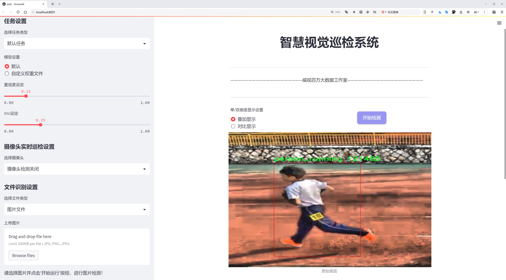
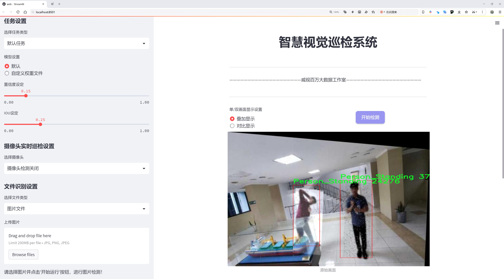
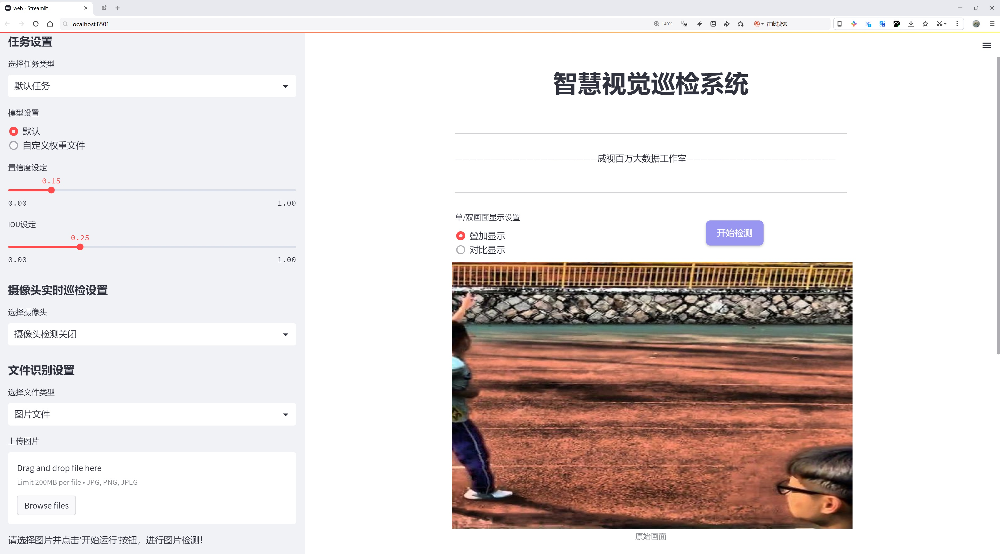
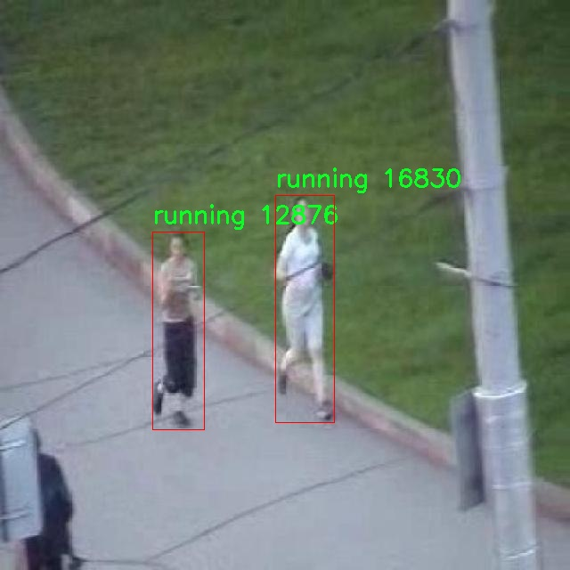
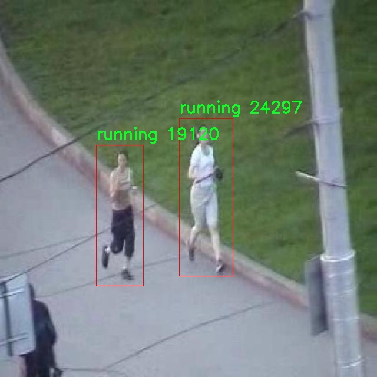
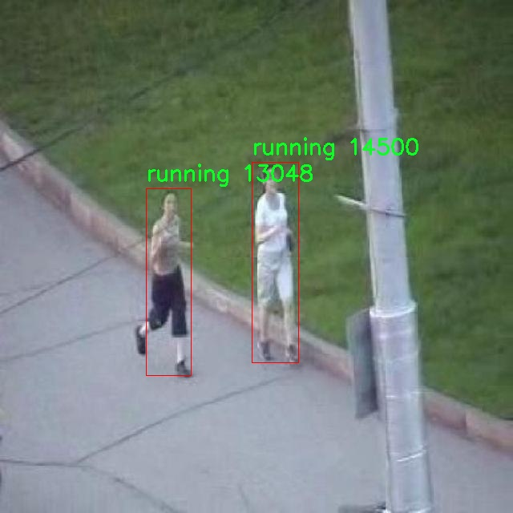
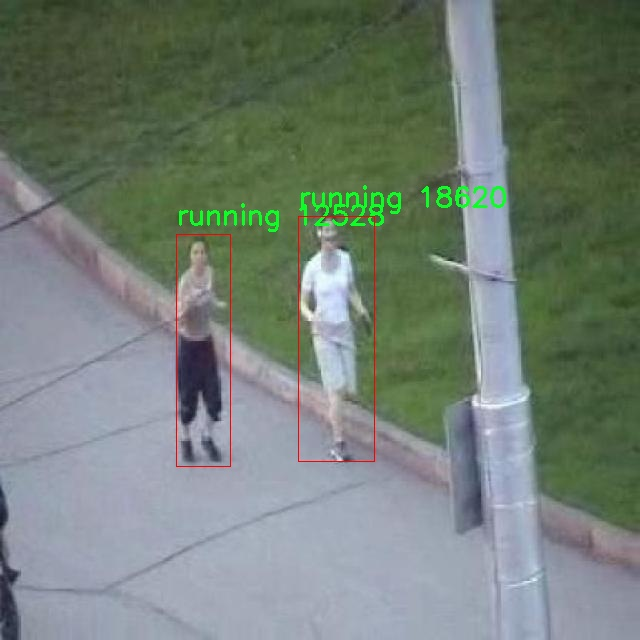
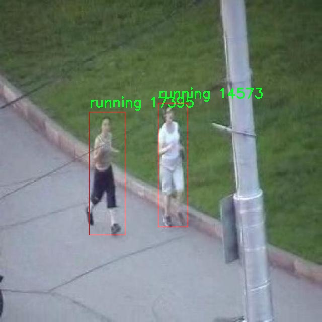

# 行人动作行为识别检测系统源码分享
 # [一条龙教学YOLOV8标注好的数据集一键训练_70+全套改进创新点发刊_Web前端展示]

### 1.研究背景与意义

项目参考[AAAI Association for the Advancement of Artificial Intelligence](https://gitee.com/qunshansj/projects)

项目来源[AACV Association for the Advancement of Computer Vision](https://gitee.com/qunmasj/projects)

研究背景与意义

随着智能城市和物联网技术的快速发展，行人行为识别作为计算机视觉领域的重要研究方向，逐渐受到学术界和工业界的广泛关注。行人行为识别不仅能够为公共安全、交通管理和人机交互等应用提供重要支持，还能够提升智能监控系统的智能化水平。在这一背景下，基于深度学习的目标检测技术，尤其是YOLO（You Only Look Once）系列模型，因其高效性和实时性，成为行人行为识别研究的热门选择。

YOLOv8作为YOLO系列的最新版本，进一步提升了模型的准确性和速度，使其在复杂场景下的行人行为识别中表现出色。然而，传统的YOLOv8模型在特定的行人行为识别任务中仍然存在一定的局限性，尤其是在多样化行为的识别和不同环境条件下的适应性方面。因此，改进YOLOv8模型以增强其在行人动作行为识别中的表现，具有重要的理论和实际意义。

本研究基于一个包含2600张图像的数据集，涵盖了七种不同的行人行为类别，包括“站立”、“行走”、“奔跑”、“跳跃”等。这些类别不仅反映了日常生活中常见的行人行为，也为模型的训练和评估提供了丰富的样本。通过对这些行为的细致分类，我们能够更深入地理解行人行为的动态特征，并为改进YOLOv8模型提供更具针对性的训练数据。这一数据集的多样性和复杂性，将为模型的泛化能力和鲁棒性提供良好的基础。

在行人行为识别的研究中，数据集的构建和标注质量直接影响到模型的训练效果和识别精度。通过对现有数据集的分析，我们发现，许多传统的数据集在行为类别的划分上较为粗糙，难以满足实际应用中的需求。因此，本研究将致力于通过数据增强、特征提取等技术手段，提升数据集的有效性和适用性，从而为改进YOLOv8模型提供更为精准的训练数据。

此外，行人行为识别的应用场景非常广泛，包括智能监控、自动驾驶、智能家居等领域。随着社会对安全和效率的日益重视，行人行为识别技术的需求将持续增长。因此，研究基于改进YOLOv8的行人动作行为识别系统，不仅能够推动计算机视觉领域的理论研究，还能够为实际应用提供切实可行的解决方案，具有重要的社会和经济价值。

综上所述，基于改进YOLOv8的行人动作行为识别系统的研究，不仅填补了现有技术在特定行为识别中的空白，还为未来的智能监控和人机交互等领域的发展奠定了基础。通过对数据集的深入分析和模型的不断优化，我们期待能够在行人行为识别领域取得更为显著的成果，为智能社会的构建贡献力量。

### 2.图片演示







##### 注意：由于此博客编辑较早，上面“2.图片演示”和“3.视频演示”展示的系统图片或者视频可能为老版本，新版本在老版本的基础上升级如下：（实际效果以升级的新版本为准）

  （1）适配了YOLOV8的“目标检测”模型和“实例分割”模型，通过加载相应的权重（.pt）文件即可自适应加载模型。

  （2）支持“图片识别”、“视频识别”、“摄像头实时识别”三种识别模式。

  （3）支持“图片识别”、“视频识别”、“摄像头实时识别”三种识别结果保存导出，解决手动导出（容易卡顿出现爆内存）存在的问题，识别完自动保存结果并导出到tempDir中。

  （4）支持Web前端系统中的标题、背景图等自定义修改，后面提供修改教程。

  另外本项目提供训练的数据集和训练教程,暂不提供权重文件（best.pt）,需要您按照教程进行训练后实现图片演示和Web前端界面演示的效果。

### 3.视频演示

[3.1 视频演示](https://www.bilibili.com/video/BV1VFtae3EY3/)

### 4.数据集信息展示

##### 4.1 本项目数据集详细数据（类别数＆类别名）

nc: 7
names: ['Person_Standing', 'Person_Walking', 'Running - v2 2023-09-23 12-33am', 'jump', 'object', 'person_running', 'running']


##### 4.2 本项目数据集信息介绍

数据集信息展示

在本研究中，我们采用了名为“Gao Pengyu”的数据集，以支持对改进YOLOv8的行人动作行为识别系统的训练和评估。该数据集的设计旨在涵盖多种行人动作和行为，以便为深度学习模型提供丰富的训练样本，从而提升其在实际应用中的准确性和鲁棒性。数据集的类别数量为七个，具体包括：‘Person_Standing’、‘Person_Walking’、‘Running - v2 2023-09-23 12-33am’、‘jump’、‘object’、‘person_running’和‘running’。这些类别的选择反映了日常生活中常见的行人行为，涵盖了从静态到动态的多种状态。

首先，‘Person_Standing’类别代表了人站立不动的状态，这一行为在许多场景中都非常普遍，如在公共场所等待、休息或与他人交谈。此类别为模型提供了对静态行为的识别能力，有助于在复杂环境中分辨出不同的活动模式。其次，‘Person_Walking’类别则专注于行走的动作，涵盖了不同的步态和速度。这一类别的样本能够帮助模型学习如何识别行人移动的基本形式，为后续的动态行为分析奠定基础。

在更为动态的行为方面，‘Running - v2 2023-09-23 12-33am’和‘person_running’类别提供了关于奔跑的多样化样本。这两个类别不仅包括不同速度和风格的奔跑，还可能涉及到不同的环境条件下的奔跑行为，如在城市街道、公园或运动场等场景中。这种多样性使得模型能够更好地适应不同的应用场景，提高其在实际监控和安全系统中的有效性。

此外，‘jump’类别则专注于跳跃动作，这一行为在体育活动和某些特定的社交场合中尤为常见。通过对跳跃行为的识别，模型能够扩展其在运动分析和行为监测中的应用潜力。‘object’类别则可能涉及到与行人互动的物体，这为模型提供了对环境中动态元素的理解能力，帮助其在复杂场景中做出更准确的判断。

最后，‘running’类别作为一个更为广泛的标签，涵盖了所有与奔跑相关的行为，进一步增强了数据集的灵活性和适应性。这一类别的存在使得模型在处理多样化的奔跑行为时，能够更好地进行归类和识别。

综上所述，“Gao Pengyu”数据集通过精心设计的七个类别，为改进YOLOv8的行人动作行为识别系统提供了丰富而多样的训练样本。这些类别不仅涵盖了静态和动态行为，还考虑到了不同环境和情境下的行人活动，极大地增强了模型的学习能力和应用潜力。通过对这一数据集的深入分析和利用，我们期望能够提升行人行为识别的准确性和实时性，为智能监控、交通管理及人机交互等领域的应用提供更为强大的技术支持。











### 5.全套项目环境部署视频教程（零基础手把手教学）

[5.1 环境部署教程链接（零基础手把手教学）](https://www.ixigua.com/7404473917358506534?logTag=c807d0cbc21c0ef59de5)


[5.2 安装Python虚拟环境创建和依赖库安装视频教程链接（零基础手把手教学）](https://www.ixigua.com/7404474678003106304?logTag=1f1041108cd1f708b01a)

### 6.手把手YOLOV8训练视频教程（零基础小白有手就能学会）

[6.1 手把手YOLOV8训练视频教程（零基础小白有手就能学会）](https://www.ixigua.com/7404477157818401292?logTag=d31a2dfd1983c9668658)

### 7.70+种全套YOLOV8创新点代码加载调参视频教程（一键加载写好的改进模型的配置文件）

[7.1 70+种全套YOLOV8创新点代码加载调参视频教程（一键加载写好的改进模型的配置文件）](https://www.ixigua.com/7404478314661806627?logTag=29066f8288e3f4eea3a4)

### 8.70+种全套YOLOV8创新点原理讲解（非科班也可以轻松写刊发刊，V10版本正在科研待更新）

由于篇幅限制，每个创新点的具体原理讲解就不一一展开，具体见下列网址中的创新点对应子项目的技术原理博客网址【Blog】：


[8.1 70+种全套YOLOV8创新点原理讲解链接](https://gitee.com/qunmasj/good)

### 9.系统功能展示（检测对象为举例，实际内容以本项目数据集为准）

图9.1.系统支持检测结果表格显示

  图9.2.系统支持置信度和IOU阈值手动调节

  图9.3.系统支持自定义加载权重文件best.pt(需要你通过步骤5中训练获得)

  图9.4.系统支持摄像头实时识别

  图9.5.系统支持图片识别

  图9.6.系统支持视频识别

  图9.7.系统支持识别结果文件自动保存

  图9.8.系统支持Excel导出检测结果数据


### 10.原始YOLOV8算法原理

原始YOLOv8算法原理

YOLOv8作为目标检测领域的最新进展，标志着YOLO系列算法的又一次重大飞跃。该算法由Ultralytics公司于2023年发布，包含了多个不同尺度的版本，如YOLOv8n、YOLOv8s、YOLOv8m等，旨在满足不同应用场景的需求。本文将重点探讨YOLOv8n的原始算法原理，深入分析其网络结构、特征提取机制及创新之处。

YOLOv8的整体架构由输入层、主干网络、颈部网络和头部网络组成。输入层负责对图像进行预处理，包括缩放和归一化，以确保输入数据符合模型的要求。主干网络是YOLOv8的核心部分，其采用了CSP（Cross Stage Partial）结构，将特征提取过程分为两个部分，通过卷积操作和特征连接来实现更高效的特征学习。主干网络的设计不仅提高了特征提取的效率，还增强了模型的表达能力。

在YOLOv8中，C2f模块的引入是一个显著的创新。C2f模块结合了YOLOv7中的E-ELAN结构，通过跨层分支连接的方式，显著改善了模型的梯度流动。这种设计使得网络在进行特征提取时，能够更好地保留信息，避免了信息的丢失，从而提升了检测的准确性和鲁棒性。C2f模块的结构中包含了更多的残差连接，这不仅有助于加速模型的收敛速度，还能在保持轻量化的同时，获取更加丰富的梯度信息。

主干网络的末尾，YOLOv8引入了SPPF（Spatial Pyramid Pooling Fast）模块。该模块通过三个最大池化层的组合，处理多尺度特征，进一步增强了网络的特征抽象能力。SPPF模块的设计旨在提高模型的计算速度，同时保持高效的特征提取能力，为后续的特征融合和检测提供了坚实的基础。

颈部网络则采用了PAN-FPN（Path Aggregation Network - Feature Pyramid Network）结构，负责将来自主干网络的多尺度特征进行融合。PAN-FPN通过不同尺度特征图的信息传递，能够有效地增强模型对目标的检测能力，尤其是在处理小目标和复杂场景时，展现出优越的性能。颈部网络的设计理念在于通过特征的多层次融合，提升模型对不同尺寸目标的敏感性和识别能力。

在检测网络方面，YOLOv8采用了Anchor-Free的检测方式，这一创新使得模型在目标检测时不再依赖于预定义的锚框，从而减少了手动调参的复杂性。YOLOv8的Detect模块使用了解耦头结构，将分类和回归任务分开处理。通过两个并行的卷积分支，模型能够分别计算目标的类别和位置，从而提高了检测的精度和效率。这种解耦的设计理念不仅简化了模型的结构，还使得模型在训练和推理时的表现更加稳定。

在损失函数的设计上，YOLOv8采用了BCELoss作为分类损失，DFLLoss和CIoULoss作为回归损失。这种组合损失函数的使用，旨在提高模型在不同任务上的学习能力，使得YOLOv8在复杂场景下的检测性能更加出色。此外，YOLOv8在训练过程中引入了动态Task-Aligned Assigner样本分配策略，并在最后10个epoch中关闭马赛克增强，进一步优化了训练效果。

总的来说，YOLOv8通过一系列创新的设计和结构优化，显著提升了目标检测的性能。其主干网络的CSP结构、C2f模块的引入、SPPF模块的使用，以及PAN-FPN的特征融合，都为模型的高效性和准确性提供了保障。同时，Anchor-Free的检测方式和解耦头结构的应用，使得YOLOv8在实际应用中更加灵活和高效。通过这些创新，YOLOv8不仅在目标检测领域树立了新的标杆，也为后续的研究和应用提供了丰富的思路和方向。


### 11.项目核心源码讲解（再也不用担心看不懂代码逻辑）

#### 11.1 ui.py

以下是经过简化和注释的核心代码部分：

```python
import sys
import subprocess

def run_script(script_path):
    """
    使用当前 Python 环境运行指定的脚本。

    Args:
        script_path (str): 要运行的脚本路径
    """
    # 获取当前 Python 解释器的路径
    python_path = sys.executable

    # 构建运行命令，使用 streamlit 运行指定的脚本
    command = f'"{python_path}" -m streamlit run "{script_path}"'

    # 执行命令并等待其完成
    result = subprocess.run(command, shell=True)
    
    # 检查命令执行结果，如果返回码不为0，表示出错
    if result.returncode != 0:
        print("脚本运行出错。")

# 程序入口
if __name__ == "__main__":
    # 指定要运行的脚本路径
    script_path = "web.py"  # 假设脚本在当前目录下

    # 调用函数运行脚本
    run_script(script_path)
```

### 代码说明：
1. **导入模块**：
   - `sys`：用于获取当前 Python 解释器的路径。
   - `subprocess`：用于执行外部命令。

2. **`run_script` 函数**：
   - 该函数接收一个脚本路径作为参数，并使用当前 Python 环境运行该脚本。
   - 使用 `sys.executable` 获取当前 Python 解释器的路径。
   - 构建命令字符串，使用 `streamlit` 运行指定的脚本。
   - 使用 `subprocess.run` 执行命令，并等待其完成。
   - 检查命令的返回码，如果不为0，表示脚本运行出错，并打印错误信息。

3. **程序入口**：
   - 使用 `if __name__ == "__main__":` 确保代码仅在直接运行时执行。
   - 指定要运行的脚本路径（假设为 "web.py"）。
   - 调用 `run_script` 函数来执行指定的脚本。

这个文件名为 `ui.py`，其主要功能是运行一个指定的 Python 脚本，具体是通过 Streamlit 框架来启动一个 Web 应用。

首先，文件导入了几个必要的模块，包括 `sys`、`os` 和 `subprocess`。其中，`sys` 模块用于访问与 Python 解释器相关的变量和函数，`os` 模块提供了与操作系统交互的功能，而 `subprocess` 模块则用于在 Python 中执行外部命令。

接下来，文件中定义了一个名为 `run_script` 的函数，该函数接受一个参数 `script_path`，表示要运行的脚本的路径。在函数内部，首先获取当前 Python 解释器的路径，使用 `sys.executable` 来实现。然后，构建一个命令字符串，格式为 `"{python_path}" -m streamlit run "{script_path}"`，这个命令会调用 Streamlit 来运行指定的脚本。

随后，使用 `subprocess.run` 方法执行这个命令，`shell=True` 参数允许在 shell 中执行命令。执行完后，检查返回的结果，如果返回码不为 0，说明脚本运行出错，程序会打印出相应的错误信息。

在文件的最后部分，使用 `if __name__ == "__main__":` 语句来确保当该文件作为主程序运行时才会执行以下代码。这里指定了要运行的脚本路径为 `web.py`，并调用 `run_script` 函数来执行这个脚本。

总的来说，这个文件的作用是提供一个简单的接口来启动一个基于 Streamlit 的 Web 应用，通过指定脚本路径来运行相应的 Python 脚本。

#### 11.2 code\ultralytics\utils\instance.py

以下是经过简化和注释的核心代码部分，主要包括 `Bboxes` 和 `Instances` 类。注释详细解释了每个方法和属性的功能。

```python
import numpy as np

class Bboxes:
    """
    处理边界框的类，支持多种格式（'xyxy', 'xywh', 'ltwh'）。
    属性:
        bboxes (numpy.ndarray): 存储边界框的二维数组。
        format (str): 边界框的格式（'xyxy', 'xywh', 或 'ltwh'）。
    """

    def __init__(self, bboxes, format="xyxy") -> None:
        """初始化 Bboxes 类，设置边界框数据和格式。"""
        assert format in ["xyxy", "xywh", "ltwh"], f"无效的边界框格式: {format}"
        bboxes = bboxes[None, :] if bboxes.ndim == 1 else bboxes  # 确保是二维数组
        assert bboxes.ndim == 2 and bboxes.shape[1] == 4, "边界框必须是形状为[N, 4]的二维数组"
        self.bboxes = bboxes
        self.format = format

    def convert(self, format):
        """将边界框格式转换为指定格式。"""
        assert format in ["xyxy", "xywh", "ltwh"], f"无效的边界框格式: {format}"
        if self.format == format:
            return  # 如果格式相同，则不进行转换
        # 根据当前格式和目标格式选择转换函数
        func = self._get_conversion_function(format)
        self.bboxes = func(self.bboxes)  # 执行转换
        self.format = format  # 更新格式

    def areas(self):
        """返回每个边界框的面积。"""
        self.convert("xyxy")  # 确保转换为 'xyxy' 格式
        return (self.bboxes[:, 2] - self.bboxes[:, 0]) * (self.bboxes[:, 3] - self.bboxes[:, 1])  # 计算面积

    def mul(self, scale):
        """按比例缩放边界框坐标。"""
        if isinstance(scale, (int, float)):
            scale = (scale, scale, scale, scale)  # 如果是单一数值，则扩展为四个相同的值
        assert len(scale) == 4, "缩放因子必须是四个值的元组或列表"
        self.bboxes[:, 0] *= scale[0]  # 左上角x
        self.bboxes[:, 1] *= scale[1]  # 左上角y
        self.bboxes[:, 2] *= scale[2]  # 右下角x
        self.bboxes[:, 3] *= scale[3]  # 右下角y

    def __len__(self):
        """返回边界框的数量。"""
        return len(self.bboxes)

    @classmethod
    def concatenate(cls, boxes_list):
        """将多个 Bboxes 对象合并为一个 Bboxes 对象。"""
        assert isinstance(boxes_list, (list, tuple)) and all(isinstance(box, Bboxes) for box in boxes_list), "输入必须是 Bboxes 对象的列表或元组"
        if not boxes_list:
            return cls(np.empty((0, 4)))  # 返回空的 Bboxes 对象
        return cls(np.concatenate([b.bboxes for b in boxes_list], axis=0))  # 合并边界框

    def _get_conversion_function(self, format):
        """根据当前格式和目标格式返回相应的转换函数。"""
        # 这里假设存在相应的转换函数
        if self.format == "xyxy":
            return xyxy2xywh if format == "xywh" else xyxy2ltwh
        elif self.format == "xywh":
            return xywh2xyxy if format == "xyxy" else xywh2ltwh
        else:
            return ltwh2xyxy if format == "xyxy" else ltwh2xywh


class Instances:
    """
    存储图像中检测到的对象的边界框、分段和关键点的容器。
    属性:
        _bboxes (Bboxes): 内部用于处理边界框操作的对象。
        keypoints (ndarray): 关键点数组，形状为 [N, 17, 3]。
        segments (ndarray): 分段数组，形状为 [N, 1000, 2]。
    """

    def __init__(self, bboxes, segments=None, keypoints=None, bbox_format="xywh", normalized=True) -> None:
        """初始化 Instances 对象，设置边界框、分段和关键点。"""
        self._bboxes = Bboxes(bboxes=bboxes, format=bbox_format)  # 创建 Bboxes 对象
        self.keypoints = keypoints
        self.normalized = normalized
        self.segments = segments

    def convert_bbox(self, format):
        """转换边界框格式。"""
        self._bboxes.convert(format=format)

    @property
    def bbox_areas(self):
        """计算边界框的面积。"""
        return self._bboxes.areas()

    def scale(self, scale_w, scale_h):
        """按宽度和高度缩放边界框、分段和关键点。"""
        self._bboxes.mul(scale=(scale_w, scale_h, scale_w, scale_h))  # 缩放边界框
        if self.segments is not None:
            self.segments[..., 0] *= scale_w  # 缩放分段x坐标
            self.segments[..., 1] *= scale_h  # 缩放分段y坐标
        if self.keypoints is not None:
            self.keypoints[..., 0] *= scale_w  # 缩放关键点x坐标
            self.keypoints[..., 1] *= scale_h  # 缩放关键点y坐标

    def __len__(self):
        """返回实例的数量。"""
        return len(self._bboxes)

    @classmethod
    def concatenate(cls, instances_list):
        """将多个 Instances 对象合并为一个 Instances 对象。"""
        assert isinstance(instances_list, (list, tuple)) and all(isinstance(instance, Instances) for instance in instances_list), "输入必须是 Instances 对象的列表或元组"
        if not instances_list:
            return cls(np.empty((0, 4)))  # 返回空的 Instances 对象
        # 合并边界框、分段和关键点
        cat_boxes = np.concatenate([ins.bboxes for ins in instances_list], axis=0)
        cat_segments = np.concatenate([ins.segments for ins in instances_list], axis=0) if instances_list[0].segments is not None else None
        cat_keypoints = np.concatenate([ins.keypoints for ins in instances_list], axis=0) if instances_list[0].keypoints is not None else None
        return cls(cat_boxes, cat_segments, cat_keypoints, bbox_format=instances_list[0]._bboxes.format, normalized=instances_list[0].normalized)
```

### 代码说明
1. **Bboxes 类**: 处理边界框的创建、格式转换、面积计算、缩放等操作。
   - `__init__`: 初始化边界框数据和格式。
   - `convert`: 转换边界框格式。
   - `areas`: 计算边界框的面积。
   - `mul`: 按比例缩放边界框。
   - `concatenate`: 合并多个 Bboxes 对象。

2. **Instances 类**: 存储和处理图像中检测到的对象的边界框、分段和关键点。
   - `__init__`: 初始化实例，设置边界框、分段和关键点。
   - `convert_bbox`: 转换边界框格式。
   - `scale`: 按宽度和高度缩放边界框、分段和关键点。
   - `concatenate`: 合并多个 Instances 对象。

这些类提供了处理边界框和实例的基本功能，适用于计算机视觉任务中的对象检测。

这个程序文件定义了一个用于处理边界框（bounding boxes）的类库，主要包括两个类：`Bboxes`和`Instances`。这些类的设计目的是为了方便在计算机视觉任务中处理和转换边界框数据。

首先，`Bboxes`类用于管理边界框。它支持多种边界框格式，包括`xyxy`（左上角和右下角坐标）、`xywh`（中心坐标和宽高）以及`ltwh`（左上角坐标和宽高）。在初始化时，`Bboxes`类会验证输入的格式和形状，确保边界框数据是一个二维的NumPy数组，且每个边界框包含四个值。

`Bboxes`类提供了多种方法，包括：
- `convert(format)`：将边界框从一种格式转换为另一种格式。
- `areas()`：计算每个边界框的面积。
- `mul(scale)`和`add(offset)`：分别用于缩放和偏移边界框的坐标。
- `__len__()`：返回边界框的数量。
- `concatenate(boxes_list)`：将多个`Bboxes`对象合并为一个。

接下来，`Instances`类是一个更高级的容器，用于存储图像中检测到的对象的边界框、分割和关键点。它内部使用`Bboxes`类来处理边界框，并提供了对分割和关键点的支持。`Instances`类的初始化方法接受边界框、分割和关键点的数组，并允许用户指定边界框的格式和是否进行归一化处理。

`Instances`类同样提供了多种方法，包括：
- `convert_bbox(format)`：转换边界框格式。
- `scale(scale_w, scale_h, bbox_only=False)`：根据给定的宽度和高度缩放边界框、分割和关键点。
- `denormalize(w, h)`和`normalize(w, h)`：分别用于反归一化和归一化边界框、分割和关键点。
- `add_padding(padw, padh)`：为边界框和分割添加填充。
- `clip(w, h)`：将边界框、分割和关键点的坐标限制在图像边界内。
- `remove_zero_area_boxes()`：移除面积为零的边界框。
- `update(bboxes, segments=None, keypoints=None)`：更新实例的边界框、分割和关键点。

此外，`Instances`类还支持通过索引获取特定的实例，并提供了`flipud(h)`和`fliplr(w)`方法来实现垂直和水平翻转。

最后，`Instances`类也提供了一个类方法`concatenate(instances_list)`，用于将多个`Instances`对象合并为一个，确保合并后的对象保持一致的属性。

总的来说，这个文件为计算机视觉中的边界框处理提供了一个灵活而强大的工具，能够支持多种格式的转换、坐标的缩放和归一化等操作，适用于目标检测和图像分割等任务。

#### 11.3 70+种YOLOv8算法改进源码大全和调试加载训练教程（非必要）\ultralytics\models\yolo\pose\predict.py

以下是经过简化和注释的核心代码部分：

```python
# 导入必要的模块和类
from ultralytics.engine.results import Results
from ultralytics.models.yolo.detect.predict import DetectionPredictor
from ultralytics.utils import DEFAULT_CFG, LOGGER, ops

class PosePredictor(DetectionPredictor):
    """
    PosePredictor类用于基于姿态模型进行预测，继承自DetectionPredictor类。
    """

    def __init__(self, cfg=DEFAULT_CFG, overrides=None, _callbacks=None):
        """初始化PosePredictor，设置任务为'pose'并记录使用'mps'作为设备的警告。"""
        super().__init__(cfg, overrides, _callbacks)  # 调用父类构造函数
        self.args.task = 'pose'  # 设置任务类型为姿态预测
        # 检查设备类型，如果是'mps'，则发出警告
        if isinstance(self.args.device, str) and self.args.device.lower() == 'mps':
            LOGGER.warning("WARNING ⚠️ Apple MPS known Pose bug. Recommend 'device=cpu' for Pose models. "
                           'See https://github.com/ultralytics/ultralytics/issues/4031.')

    def postprocess(self, preds, img, orig_imgs):
        """对给定输入图像或图像列表返回检测结果。"""
        # 应用非极大值抑制（NMS）来过滤检测结果
        preds = ops.non_max_suppression(preds,
                                        self.args.conf,  # 置信度阈值
                                        self.args.iou,   # IOU阈值
                                        agnostic=self.args.agnostic_nms,  # 是否类别无关
                                        max_det=self.args.max_det,  # 最大检测数量
                                        classes=self.args.classes,  # 选择的类别
                                        nc=len(self.model.names))  # 类别数量

        # 如果输入图像不是列表，则将其转换为numpy数组
        if not isinstance(orig_imgs, list):
            orig_imgs = ops.convert_torch2numpy_batch(orig_imgs)

        results = []  # 存储结果的列表
        for i, pred in enumerate(preds):  # 遍历每个预测结果
            orig_img = orig_imgs[i]  # 获取原始图像
            # 将预测框的坐标缩放到原始图像的尺寸
            pred[:, :4] = ops.scale_boxes(img.shape[2:], pred[:, :4], orig_img.shape).round()
            # 获取关键点预测
            pred_kpts = pred[:, 6:].view(len(pred), *self.model.kpt_shape) if len(pred) else pred[:, 6:]
            # 缩放关键点坐标
            pred_kpts = ops.scale_coords(img.shape[2:], pred_kpts, orig_img.shape)
            img_path = self.batch[0][i]  # 获取图像路径
            # 将结果添加到结果列表中
            results.append(
                Results(orig_img, path=img_path, names=self.model.names, boxes=pred[:, :6], keypoints=pred_kpts))
        return results  # 返回所有结果
```

### 代码说明：
1. **导入模块**：引入必要的类和函数，以便后续使用。
2. **PosePredictor类**：继承自`DetectionPredictor`，用于姿态预测。
3. **构造函数**：初始化时设置任务类型为姿态，并对使用的设备进行检查，若为`mps`则发出警告。
4. **后处理函数**：处理模型的预测结果，包括应用非极大值抑制（NMS）和坐标缩放，最终返回处理后的结果。

该程序文件是一个用于姿态预测的类`PosePredictor`，它继承自`DetectionPredictor`类，主要用于基于YOLOv8模型进行姿态检测。文件开头包含了版权信息，表明该代码遵循AGPL-3.0许可证。

在类的定义中，首先通过文档字符串提供了使用示例，展示了如何导入`PosePredictor`并使用它进行预测。用户可以通过指定模型文件和数据源来创建`PosePredictor`的实例，并调用`predict_cli()`方法进行预测。

构造函数`__init__`中，调用了父类的构造函数，并将任务类型设置为'pose'。此外，它还检查设备类型，如果设备是'MPS'（Apple的Metal Performance Shaders），则会发出警告，建议用户使用'cpu'设备来避免已知的姿态检测问题。

`postprocess`方法用于处理预测结果。它接收预测结果、输入图像及原始图像作为参数。首先，它使用非极大值抑制（NMS）来过滤掉低置信度的检测结果。接着，如果输入的原始图像不是列表格式（即是一个torch.Tensor），则将其转换为numpy数组格式。

随后，方法会遍历每个预测结果，调整预测框的坐标以适应原始图像的尺寸，并提取关键点坐标。关键点的坐标也会进行相应的缩放。最后，方法将处理后的结果封装成`Results`对象，包括原始图像、图像路径、模型名称、检测框和关键点信息，并将这些结果返回。

整体来看，该文件实现了一个姿态预测的工具，结合了YOLOv8的检测能力，能够有效地处理输入图像并返回姿态检测的结果。

#### 11.4 code\ultralytics\utils\downloads.py

以下是代码中最核心的部分，并附上详细的中文注释：

```python
import requests
from pathlib import Path
from zipfile import ZipFile, is_zipfile
from tqdm import tqdm  # 进度条库

def safe_download(url, file=None, dir=None, unzip=True, delete=False, retry=3, min_bytes=1e0, exist_ok=False):
    """
    从指定的 URL 下载文件，并可选择解压缩和删除下载的文件。

    参数:
        url (str): 要下载的文件的 URL。
        file (str, optional): 下载文件的文件名。如果未提供，将使用 URL 的文件名。
        dir (str, optional): 保存下载文件的目录。如果未提供，将保存在当前工作目录。
        unzip (bool, optional): 是否解压下载的文件。默认值为 True。
        delete (bool, optional): 是否在解压后删除下载的文件。默认值为 False。
        retry (int, optional): 下载失败时的重试次数。默认值为 3。
        min_bytes (float, optional): 下载文件被视为成功的最小字节数。默认值为 1E0。
        exist_ok (bool, optional): 解压时是否覆盖现有内容。默认值为 False。

    返回:
        (Path): 解压缩后的目录路径。
    """
    f = Path(dir or ".") / (file or url.split("/")[-1])  # 设置下载文件的路径
    if not f.is_file():  # 如果文件不存在，则开始下载
        desc = f"Downloading {url} to '{f}'"
        print(desc)  # 输出下载信息
        f.parent.mkdir(parents=True, exist_ok=True)  # 创建目录
        for i in range(retry + 1):  # 尝试下载
            try:
                response = requests.get(url, stream=True)  # 发起请求
                response.raise_for_status()  # 检查请求是否成功
                with open(f, "wb") as f_opened:  # 打开文件以写入
                    total_size = int(response.headers.get("Content-Length", 0))  # 获取文件大小
                    for data in tqdm(response.iter_content(chunk_size=8192), total=total_size // 8192, unit='KB'):
                        f_opened.write(data)  # 写入文件
                if f.stat().st_size > min_bytes:  # 检查文件大小
                    break  # 下载成功
                f.unlink()  # 删除部分下载的文件
            except Exception as e:
                if i >= retry:
                    raise ConnectionError(f"下载失败: {url}") from e  # 超过重试次数，抛出异常

    if unzip and f.exists() and f.suffix in (".zip", ".tar", ".gz"):  # 如果需要解压
        unzip_dir = dir or f.parent  # 解压目录
        if is_zipfile(f):  # 如果是 zip 文件
            with ZipFile(f) as zipObj:
                zipObj.extractall(unzip_dir)  # 解压所有文件
        if delete:  # 如果需要删除
            f.unlink()  # 删除下载的文件
        return unzip_dir  # 返回解压目录
```

### 代码核心功能说明：
1. **下载文件**：从指定的 URL 下载文件，支持重试机制。
2. **解压缩**：下载完成后，如果文件是压缩文件（如 zip），则自动解压缩。
3. **文件管理**：支持删除下载的文件，避免占用磁盘空间。
4. **进度显示**：使用 `tqdm` 库显示下载进度，提升用户体验。

### 使用示例：
```python
url = "https://example.com/file.zip"
downloaded_dir = safe_download(url, dir="downloads", unzip=True, delete=True)
print(f"文件已下载并解压到: {downloaded_dir}")
``` 

这个核心部分的代码能够有效地处理文件下载和解压缩的任务，适用于需要从网络获取数据的场景。

这个程序文件 `downloads.py` 是 Ultralytics YOLO 项目的一部分，主要用于处理文件的下载、解压和相关的文件管理操作。代码中使用了多种 Python 库，如 `requests`、`torch` 和 `zipfile`，以实现高效的文件处理。

文件开头定义了一些常量，包括 Ultralytics GitHub 资源库的名称和一些常用的模型文件名。这些文件名是根据 YOLO 系列模型的不同版本和功能生成的。

接下来的函数主要包括：

1. **is_url**：验证给定字符串是否为有效的 URL，并可选择性地检查该 URL 是否在线可用。使用 `urllib` 库解析 URL，并通过 `urlopen` 方法检查其响应状态。

2. **delete_dsstore**：删除指定目录下的 `.DS_Store` 文件，这些文件是 macOS 系统生成的隐藏文件，可能在不同操作系统间传输时造成问题。

3. **zip_directory**：将指定目录的内容压缩为 ZIP 文件，并排除特定的文件。该函数使用 `zipfile` 库来创建压缩文件，并可以显示压缩进度。

4. **unzip_file**：解压缩 ZIP 文件到指定路径，并同样排除特定文件。该函数会根据 ZIP 文件的结构决定解压的目标目录，并确保安全性，避免路径遍历漏洞。

5. **check_disk_space**：检查下载文件所需的磁盘空间是否充足。它会获取文件的大小，并与当前可用的磁盘空间进行比较，确保有足够的空间来存储下载的文件。

6. **get_google_drive_file_info**：从 Google Drive 的共享链接中提取直接下载链接和文件名。该函数会处理 Google Drive 的下载限制，并返回有效的下载链接。

7. **safe_download**：实现从 URL 下载文件的功能，支持重试、解压和删除下载的文件。该函数可以处理 Google Drive 链接，并使用 `torch` 或 `curl` 进行下载，确保下载的文件符合大小要求。

8. **get_github_assets**：从指定的 GitHub 仓库获取发布版本的标签和资产列表。该函数可以获取最新版本或指定版本的资源。

9. **attempt_download_asset**：尝试从 GitHub 下载指定的文件，如果本地不存在则进行下载。该函数会先检查本地是否已有文件，若没有则构建下载链接并调用 `safe_download` 进行下载。

10. **download**：主下载函数，支持从一个或多个 URL 下载文件到指定目录，并可以选择解压和删除 ZIP 文件。支持多线程下载，以提高下载效率。

整个文件通过封装这些功能，提供了一个完整的文件下载和管理的解决方案，适用于需要从网络获取模型文件或数据集的场景。

#### 11.5 code\ultralytics\models\utils\ops.py

以下是经过简化和注释的核心代码部分，主要集中在 `HungarianMatcher` 类及其方法上：

```python
import torch
import torch.nn as nn
import torch.nn.functional as F
from scipy.optimize import linear_sum_assignment
from ultralytics.utils.metrics import bbox_iou

class HungarianMatcher(nn.Module):
    """
    实现匈牙利算法匹配器，用于解决预测框与真实框之间的最优匹配问题。
    匈牙利匹配器根据分类分数、边界框坐标等计算成本，并进行最优匹配。
    """

    def __init__(self, cost_gain=None, use_fl=True, with_mask=False):
        """初始化匈牙利匹配器的参数，包括成本系数和是否使用焦点损失等。"""
        super().__init__()
        if cost_gain is None:
            cost_gain = {"class": 1, "bbox": 5, "giou": 2}  # 成本系数初始化
        self.cost_gain = cost_gain
        self.use_fl = use_fl  # 是否使用焦点损失
        self.with_mask = with_mask  # 是否使用掩码预测

    def forward(self, pred_bboxes, pred_scores, gt_bboxes, gt_cls, gt_groups):
        """
        前向传播，计算预测框与真实框之间的匹配。
        
        参数:
            pred_bboxes (Tensor): 预测的边界框，形状为 [batch_size, num_queries, 4]。
            pred_scores (Tensor): 预测的分类分数，形状为 [batch_size, num_queries, num_classes]。
            gt_bboxes (Tensor): 真实的边界框，形状为 [num_gts, 4]。
            gt_cls (Tensor): 真实的类别，形状为 [num_gts, ]。
            gt_groups (List[int]): 每个图像的真实框数量。

        返回:
            List[Tuple[Tensor, Tensor]]: 每个batch的匹配结果，包含预测索引和真实索引。
        """
        bs, nq, nc = pred_scores.shape  # 获取batch_size、查询数量和类别数量

        if sum(gt_groups) == 0:  # 如果没有真实框，返回空匹配
            return [(torch.tensor([], dtype=torch.long), torch.tensor([], dtype=torch.long)) for _ in range(bs)]

        # 扁平化处理以计算成本矩阵
        pred_scores = pred_scores.detach().view(-1, nc)
        pred_scores = F.sigmoid(pred_scores) if self.use_fl else F.softmax(pred_scores, dim=-1)
        pred_bboxes = pred_bboxes.detach().view(-1, 4)

        # 计算分类成本
        pred_scores = pred_scores[:, gt_cls]  # 选择对应的真实类别分数
        cost_class = -pred_scores  # 分类成本为负分数

        # 计算边界框的L1成本
        cost_bbox = (pred_bboxes.unsqueeze(1) - gt_bboxes.unsqueeze(0)).abs().sum(-1)  # 计算L1距离

        # 计算GIoU成本
        cost_giou = 1.0 - bbox_iou(pred_bboxes.unsqueeze(1), gt_bboxes.unsqueeze(0), xywh=True, GIoU=True).squeeze(-1)

        # 组合最终成本矩阵
        C = (
            self.cost_gain["class"] * cost_class
            + self.cost_gain["bbox"] * cost_bbox
            + self.cost_gain["giou"] * cost_giou
        )

        # 将无效值（NaN和无穷大）设置为0
        C[C.isnan() | C.isinf()] = 0.0

        C = C.view(bs, nq, -1).cpu()  # 重新调整形状以便进行匹配
        indices = [linear_sum_assignment(c[i]) for i, c in enumerate(C.split(gt_groups, -1))]  # 使用匈牙利算法进行匹配
        gt_groups = torch.as_tensor([0, *gt_groups[:-1]]).cumsum_(0)  # 计算真实框的索引
        return [
            (torch.tensor(i, dtype=torch.long), torch.tensor(j, dtype=torch.long) + gt_groups[k])
            for k, (i, j) in enumerate(indices)
        ]
```

### 代码注释说明：
1. **类的定义**：`HungarianMatcher` 类用于实现匈牙利算法匹配器，主要用于计算预测框与真实框之间的最优匹配。
2. **初始化方法**：在初始化时设置成本系数、是否使用焦点损失和掩码预测的标志。
3. **前向传播方法**：`forward` 方法接收预测框、预测分数、真实框和类别信息，计算匹配成本并返回匹配结果。
4. **成本计算**：
   - 分类成本：根据预测的分数计算。
   - L1成本：计算预测框与真实框之间的L1距离。
   - GIoU成本：计算预测框与真实框之间的广义IoU。
5. **匹配算法**：使用 `linear_sum_assignment` 函数实现匈牙利算法进行最优匹配。

以上是代码的核心部分和详细注释，帮助理解匈牙利匹配器的实现及其工作原理。

这个程序文件定义了一个名为 `HungarianMatcher` 的类，主要用于解决目标检测中的分配问题。它通过匈牙利算法在预测的边界框和真实的边界框之间进行最优匹配。该类继承自 `torch.nn.Module`，并实现了前向传播方法，计算分类成本、边界框成本和GIoU（广义交并比）成本，从而找到最佳匹配。

在初始化方法中，`HungarianMatcher` 接受多个参数，包括成本系数、是否使用焦点损失、是否进行掩码预测、样本点数量以及焦点损失的超参数（alpha和gamma）。如果未提供成本系数，则使用默认值。

`forward` 方法是该类的核心，接收预测的边界框、预测的分类分数、真实的边界框、真实的类别、真实的组信息以及可选的掩码。首先，它将输入的张量展平以便于计算。接着，根据分类分数计算分类成本，使用焦点损失或普通的softmax进行处理。然后，计算预测边界框与真实边界框之间的L1成本和GIoU成本。最终，将所有成本加权合并，形成最终的成本矩阵。

如果模型支持掩码预测，还会调用 `_cost_mask` 方法计算掩码成本（该方法目前被注释掉）。最后，使用 `linear_sum_assignment` 函数求解最优匹配，并返回每个批次中选择的预测和真实目标的索引。

此外，文件中还定义了一个 `get_cdn_group` 函数，用于创建对比去噪训练组。该函数通过对类别标签和边界框坐标添加噪声，生成正负样本。它接收一个包含真实类别、边界框和组信息的字典，以及其他一些参数。函数首先检查是否处于训练模式以及去噪数量是否大于零，然后根据输入生成修改后的类别嵌入、边界框、注意力掩码和元信息。

总的来说，这个文件实现了目标检测中关键的匹配算法，并为模型训练提供了必要的支持，尤其是在处理复杂的掩码和类别信息时。

#### 11.6 train.py

以下是经过简化和注释的核心代码部分，主要关注于YOLO检测模型的训练过程。

```python
import random
import numpy as np
import torch.nn as nn
from ultralytics.data import build_dataloader, build_yolo_dataset
from ultralytics.engine.trainer import BaseTrainer
from ultralytics.models import yolo
from ultralytics.nn.tasks import DetectionModel
from ultralytics.utils import LOGGER, RANK
from ultralytics.utils.torch_utils import de_parallel, torch_distributed_zero_first

class DetectionTrainer(BaseTrainer):
    """
    扩展自BaseTrainer类，用于基于检测模型的训练。
    """

    def build_dataset(self, img_path, mode="train", batch=None):
        """
        构建YOLO数据集。

        参数:
            img_path (str): 包含图像的文件夹路径。
            mode (str): 模式，可以是'train'或'val'，用户可以为每种模式自定义不同的增强。
            batch (int, optional): 批次大小，适用于'rect'模式。默认为None。
        """
        gs = max(int(de_parallel(self.model).stride.max() if self.model else 0), 32)
        return build_yolo_dataset(self.args, img_path, batch, self.data, mode=mode, rect=mode == "val", stride=gs)

    def get_dataloader(self, dataset_path, batch_size=16, rank=0, mode="train"):
        """构造并返回数据加载器。"""
        assert mode in ["train", "val"]
        with torch_distributed_zero_first(rank):  # 仅在DDP中初始化数据集*.cache一次
            dataset = self.build_dataset(dataset_path, mode, batch_size)
        shuffle = mode == "train"  # 训练模式下打乱数据
        workers = self.args.workers if mode == "train" else self.args.workers * 2
        return build_dataloader(dataset, batch_size, workers, shuffle, rank)  # 返回数据加载器

    def preprocess_batch(self, batch):
        """对一批图像进行预处理，包括缩放和转换为浮点数。"""
        batch["img"] = batch["img"].to(self.device, non_blocking=True).float() / 255  # 将图像转换为浮点数并归一化
        if self.args.multi_scale:  # 如果启用多尺度训练
            imgs = batch["img"]
            sz = (
                random.randrange(self.args.imgsz * 0.5, self.args.imgsz * 1.5 + self.stride)
                // self.stride
                * self.stride
            )  # 随机选择新的图像大小
            sf = sz / max(imgs.shape[2:])  # 计算缩放因子
            if sf != 1:
                ns = [
                    math.ceil(x * sf / self.stride) * self.stride for x in imgs.shape[2:]
                ]  # 计算新的形状
                imgs = nn.functional.interpolate(imgs, size=ns, mode="bilinear", align_corners=False)  # 调整图像大小
            batch["img"] = imgs
        return batch

    def get_model(self, cfg=None, weights=None, verbose=True):
        """返回YOLO检测模型。"""
        model = DetectionModel(cfg, nc=self.data["nc"], verbose=verbose and RANK == -1)  # 创建检测模型
        if weights:
            model.load(weights)  # 加载预训练权重
        return model

    def plot_training_samples(self, batch, ni):
        """绘制带有注释的训练样本。"""
        plot_images(
            images=batch["img"],
            batch_idx=batch["batch_idx"],
            cls=batch["cls"].squeeze(-1),
            bboxes=batch["bboxes"],
            paths=batch["im_file"],
            fname=self.save_dir / f"train_batch{ni}.jpg",
            on_plot=self.on_plot,
        )

    def plot_metrics(self):
        """从CSV文件中绘制指标。"""
        plot_results(file=self.csv, on_plot=self.on_plot)  # 保存结果图像
```

### 代码说明：
1. **DetectionTrainer类**：这是一个用于训练YOLO检测模型的类，继承自`BaseTrainer`。
2. **build_dataset方法**：构建YOLO数据集，接收图像路径、模式和批次大小作为参数。
3. **get_dataloader方法**：创建数据加载器，支持训练和验证模式，并根据模式决定是否打乱数据。
4. **preprocess_batch方法**：对输入的图像批次进行预处理，包括归一化和可能的缩放处理。
5. **get_model方法**：返回一个YOLO检测模型实例，并可选择加载预训练权重。
6. **plot_training_samples和plot_metrics方法**：用于可视化训练样本和训练过程中的指标。

以上是YOLO检测模型训练的核心代码及其详细注释。

这个程序文件 `train.py` 是一个用于训练 YOLO（You Only Look Once）目标检测模型的实现，继承自 `BaseTrainer` 类。程序的主要功能是构建数据集、加载数据、预处理图像、设置模型属性、获取模型、验证模型、记录损失、绘制训练样本和绘制训练指标等。

在文件开头，导入了一些必要的库和模块，包括数学运算、随机数生成、深度学习相关的库以及 YOLO 模型和数据处理的工具。

`DetectionTrainer` 类是该文件的核心，负责管理训练过程。它提供了多个方法：

- `build_dataset` 方法用于构建 YOLO 数据集，接收图像路径、模式（训练或验证）和批次大小作为参数。它会根据模型的步幅计算出合适的步幅，并调用 `build_yolo_dataset` 函数来创建数据集。

- `get_dataloader` 方法构建并返回数据加载器。它会根据模式选择是否打乱数据，并根据需要调整工作线程的数量。

- `preprocess_batch` 方法对图像批次进行预处理，包括将图像缩放到合适的大小并转换为浮点数格式。

- `set_model_attributes` 方法用于设置模型的属性，包括类别数量和类别名称等。

- `get_model` 方法返回一个 YOLO 检测模型，可以选择加载预训练权重。

- `get_validator` 方法返回一个用于验证 YOLO 模型的验证器，记录损失名称。

- `label_loss_items` 方法返回一个包含训练损失项的字典，便于监控训练过程中的损失变化。

- `progress_string` 方法返回一个格式化的字符串，显示训练进度，包括当前的 epoch、GPU 内存使用情况、损失值、实例数量和图像大小。

- `plot_training_samples` 方法用于绘制训练样本及其标注，方便可视化训练数据的质量。

- `plot_metrics` 方法从 CSV 文件中绘制训练指标，以便分析训练效果。

- `plot_training_labels` 方法创建一个带有标注的训练图，显示数据集中所有标注的边界框和类别。

整体而言，这个文件实现了 YOLO 模型训练的各个环节，提供了丰富的功能以支持模型的训练、验证和结果可视化，适合于深度学习研究和应用开发。

### 12.系统整体结构（节选）

### 整体功能和构架概括

该项目是一个基于 YOLOv8 的目标检测和姿态估计框架，提供了从数据下载、模型训练到推理的完整解决方案。项目的主要功能包括：

1. **数据处理**：支持从网络下载数据集，处理图像和标签，构建训练和验证数据集。
2. **模型训练**：提供了训练 YOLO 模型的功能，包括损失计算、模型验证和训练进度监控。
3. **推理与预测**：实现了对图像或视频的实时目标检测和姿态估计。
4. **可视化**：支持训练样本和训练指标的可视化，便于用户理解模型的训练过程和效果。
5. **模块化设计**：代码结构清晰，功能模块化，便于扩展和维护。

### 文件功能整理表

| 文件路径                                                                 | 功能描述                                                                                     |
|--------------------------------------------------------------------------|---------------------------------------------------------------------------------------------|
| `ui.py`                                                                  | 启动一个基于 Streamlit 的 Web 应用，用于运行指定的 Python 脚本。                            |
| `code\ultralytics\utils\instance.py`                                    | 定义 `Bboxes` 和 `Instances` 类，用于管理和处理边界框及其相关信息。                        |
| `70+种YOLOv8算法改进源码大全和调试加载训练教程（非必要）\ultralytics\models\yolo\pose\predict.py` | 实现姿态预测的 `PosePredictor` 类，使用 YOLOv8 模型进行姿态检测。                         |
| `code\ultralytics\utils\downloads.py`                                   | 提供文件下载、解压和管理的功能，支持从网络获取模型文件和数据集。                          |
| `code\ultralytics\models\utils\ops.py`                                  | 实现 `HungarianMatcher` 类，用于目标检测中的边界框匹配，支持计算各种成本。                |
| `train.py`                                                               | 负责训练 YOLO 模型的主程序，管理数据集构建、模型训练和验证过程。                          |
| `code\ultralytics\models\yolo\detect\train.py`                         | 具体实现 YOLO 模型的训练过程，包含数据加载、损失计算和训练进度监控等功能。               |
| `70+种YOLOv8算法改进源码大全和调试加载训练教程（非必要）\ultralytics\models\yolo\classify\__init__.py` | 初始化分类模型模块，提供分类相关的功能和接口。                                            |
| `70+种YOLOv8算法改进源码大全和调试加载训练教程（非必要）\ultralytics\models\sam\amg.py` | 实现与 SAM（Segment Anything Model）相关的功能，可能涉及图像分割或相关处理。             |
| `70+种YOLOv8算法改进源码大全和调试加载训练教程（非必要）\ultralytics\nn\backbone\CSwomTramsformer.py` | 定义 CSWOM Transformer 模型的结构，可能用于特征提取或增强。                               |
| `70+种YOLOv8算法改进源码大全和调试加载训练教程（非必要）\ultralytics\nn\extra_modules\attention.py` | 实现注意力机制模块，增强模型的特征学习能力。                                             |
| `70+种YOLOv8算法改进源码大全和调试加载训练教程（非必要）\ultralytics\utils\files.py` | 提供文件处理相关的工具函数，如文件读写、路径管理等。                                     |
| `70+种YOLOv8算法改进源码大全和调试加载训练教程（非必要）\ultralytics\models\rtdetr\__init__.py` | 初始化 RT-DETR 模型模块，提供与 RT-DETR 相关的功能和接口。                               |

以上表格整理了每个文件的功能，展示了该项目的模块化结构和各个部分的职责。

注意：由于此博客编辑较早，上面“11.项目核心源码讲解（再也不用担心看不懂代码逻辑）”中部分代码可能会优化升级，仅供参考学习，完整“训练源码”、“Web前端界面”和“70+种创新点源码”以“13.完整训练+Web前端界面+70+种创新点源码、数据集获取”的内容为准。

### 13.完整训练+Web前端界面+70+种创新点源码、数据集获取


# [下载链接：https://mbd.pub/o/bread/ZpuWlZdp](https://mbd.pub/o/bread/ZpuWlZdp)